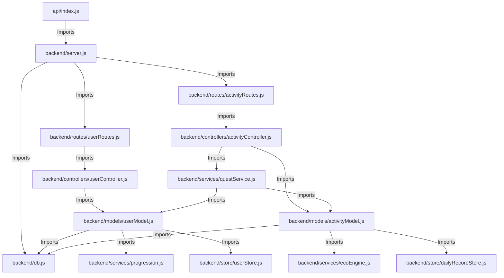

# 🌍 Eco-Tracker: Complete Project & Codebase Explanation (Hinglish Version)

Hey! Agar aap Eco-Tracker project ko aasan bhasha (Hindi-English mix) mein samajhna chahte hain, toh yeh guide aapke liye perfect hai. Is documentation mein hum pure project ke structure, key components, import relationships, complete execution flow aur core code ki line-by-line working ko bilkul simple aur interactive tarike se samjhenge.

---

## 🌟 1. Eco-Tracker Kya Hai? (Overview)

**Eco-Tracker** ek full-stack MERN-like web application hai jo users ko unki daily activities (jaise travel, phone charging, steps, electricity bills) ke basis par unka **Carbon Footprint** track karne me help karta hai. 

Isme ek bahut hi cool **Gamification Engine** lagaya gaya hai:
- **XP & Levels:** Jaise-jaise aap carbon emissions kam karenge, aapko XP (Experience Points) milenge aur aapka level badhega.
- **Daily Quests:** Har din 3 eco-friendly tasks milte hain (jaise: 'Short Walk', 'Meatless Meal'). Inhe complete karne par reward points aur badges milte hain.
- **Dual Storage System (Smart Feature):** Agar aapke paas MongoDB configured nahi hai, toh backend automatic local JSON files (`backend/store/`) par fallback ho jata hai. Yani project bina kisi complex database setup ke instantly run ho sakta hai!

---

## 📁 2. Complete File Structure Explanation

Chaliye poore project ke folder structure par ek nazar dalte hain:

```text
Eco-Tracker-main/
│
├── 📂 api/                       # Vercel Serverless Functions entry point
│   └── 📄 index.js               # Vercel request ko Express backend me route karta hai
│
├── 📂 backend/                   # Node.js + Express backend server
│   ├── 📄 server.js              # Server entry point aur CORS/Middleware setup
│   ├── 📄 db.js                  # MongoDB setup aur local file storage fallback logic
│   ├── 📄 constants.js           # Grid emission factor, baseline aur daily goals constants
│   ├── 📄 bootstrapEnv.js        # Environment variables load aur config karne ke liye
│   │
│   ├── 📂 controllers/           # API Handlers jo route request aur business logic ko connect karte hain
│   │   ├── 📄 userController.js  # Registration, Login, Profile and Leaderboard request handling
│   │   └── 📄 activityController.js# Daily activities, triggers, battery updates, and quest completions
│   │
│   ├── 📂 models/                # Business logic wrappers aur schema abstraction
│   │   ├── 📄 userModel.js       # User profile creation, update aur carbon footprint management
│   │   └── 📄 activityModel.js   # Daily records track aur mutate karne ki logic
│   │
│   ├── 📂 routes/                # Backend routes (API Endpoints)
│   │   ├── 📄 userRoutes.js      # Auth, profile settings aur leaderboard endpoints
│   │   └── 📄 activityRoutes.js  # Daily logs, Google Fit sync aur quests endpoints
│   │
│   ├── 📂 services/              # Core algorithms aur mathematical engine
│   │   ├── 📄 ecoEngine.js       # Carbon footprint aur XP calculation calculations
│   │   ├── 📄 progression.js     # User level-up logic aur Badge rewarding algorithm
│   │   ├── 📄 questGenerator.js  # Dynamic quests generate karne ka logic
│   │   └── 📄 questService.js    # Quests status, completion aur daily assignment manage karta hai
│   │
│   └── 📂 store/                 # Database Fallback (Local JSON Files)
│       ├── 📄 userStore.js       # Local user data JSON CRUD operations
│       └── 📄 dailyRecordStore.js# Local daily activity data JSON CRUD operations
│
├── 📂 frontend/                  # React + Vite frontend application
│   ├── 📄 vite.config.js         # Vite configuration settings
│   ├── 📄 index.html             # React core entry template
│   ├── 📂 public/                # Static public assets (logos, images, etc.)
│   └── 📂 src/                   # React frontend source code
│       ├── 📄 main.jsx           # App render entry file
│       ├── 📄 App.jsx            # Routing aur active session handler
│       ├── 📄 App.css & index.css# Base CSS styles and CSS Variables (Design system)
│       │
│       ├── 📂 pages/             # Authenticated page layouts
│       │   ├── 📄 LoginPage.jsx  # Elegant, sleek login design with animations
│       │   └── 📄 SignupPage.jsx # Multi-step onboarding form with responsive layouts
│       │
│       ├── 📂 views/             # Module-wise sub-interfaces (Dashboard content panels)
│       │   ├── 📄 DashboardView.jsx# XP trackers, Active quests aur gauge gauges
│       │   ├── 📄 ActivityView.jsx# Steps, travel, active device, bills dynamic trackers
│       │   ├── 📄 GoalsView.jsx   # Green goals scheduler and status check
│       │   ├── 📄 JournalView.jsx # Eco-friendly dairy entries
│       │   └── 📄 Profile.jsx     # Profile options and details
│       │
│       └── 📂 components/        # Reusable component files (Dashboard shell layout)
│           └── 📄 Dashboard.jsx  # The giant responsive dashboard shell with sidebars
```

---

## 🔍 3. Import Architecture & Dependency Flow (Kaun Kise Import Karta Hai?)

Ek clean codebase ko samajhne ke liye yeh janna zaroori hai ki files aapas mein kaise imports ke through connected hain. Chaliye is pure dependency mapping ko aasan words mein dekhte hain:



---

## ⚡ 4. Real-time Request Flow (Ek API Call Kaise Execute Hoti Hai?)

Chaliye ek real-time example se samajhte hain ki jab user frontend par **"I walked 2 Kilometers"** enter karta hai, toh code me execution ka flow kaise chalta hai:

### Step 1: Frontend Activity Trigger
* User `ActivityView.jsx` par jake physical activity (e.g. Walking, 2km) save karta hai.
* Frontend code backend endpoint `POST /api/activities/trigger` par ek data request push karta hai.

### Step 2: Vercel Entry & Express Routing
* Serverless environment me request `api/index.js` me aati hai, jo use Express app (`backend/server.js`) me delegate kar deti hai.
* `server.js` me laga middleware check karta hai ki database available hai ya nahi (`initializeDataLayer()`).
* Request router `backend/routes/activityRoutes.js` se hote hue `handleTriggerActivity` controller endpoint par pahunchti hai.

---

## 📖 5. Important Line-by-Line Code Explanation (Core Functions)

Chaliye system ke 3 sabse important functions ke code ko **line-by-line** bilkul deep detail aur aasan Hinglish me samajhte hain:

### A. Database Choice & Fallback Algorithm (`backend/db.js`)
Yeh function handle karta hai ki database local JSON backup use karega ya live MongoDB database.

```javascript
// Line 156: Function definition jo connection check ya initialize karegi.
export async function connectToDatabase() {

  // Line 157-160: Agar configuration me data provider 'file' set hai, to local offline store directly load karo aur execution end karo.
  if (DATA_PROVIDER === 'file') {
    activateFileStore(null); // Local JSON files storage chalu ho jati hai
    return null;
  }

  // Line 162-164: Agar system pehle hi active file fallback layer pe chal raha hai, to return empty.
  if (persistenceMode === 'file') {
    return null;
  }

  // Line 166-168: Agar already MongoDB connected hai, to wahi database instance load karo (reconnection avoid karne ke liye).
  if (databaseInstance) {
    return databaseInstance;
  }

  // Line 170: Agar database connection sequence initiation empty hai.
  if (!clientPromise) {
    
    // Line 171: Agar MongoDB connection string (URI) config file me miss hai.
    if (!DEFAULT_URI) {
      
      // Line 172-175: Agar user local mode trigger kar sakta hai, to local directory fallback assign karo aur crash hone se bacho.
      if (canUseFileFallback()) {
        activateFileStore('[eco-backend] MONGODB_URI not configured. Using local JSON storage.');
        return null;
      }
      
      // Line 177: MongoDB check parameters assert verify karo (Throw Error agar fallback available na ho).
      assertPrimaryConfiguration(DEFAULT_URI);
    }
    
    // Line 180-181: Connect parameters inputs evaluate karo fallback systems setup ke sath.
    assertPrimaryConfiguration(DEFAULT_URI);
    assertFallbackConfiguration(FALLBACK_URI);
    connectionState = 'connecting';
    persistenceMode = 'mongo';
    lastConnectionError = null;
    
    // Line 185: Async connect process trigger line.
    clientPromise = (async () => {
      try {
        // Line 187-190: Default database connection try karega.
        const client = await connectClient(DEFAULT_URI);
        connectedUri = DEFAULT_URI;
        connectionState = 'connected';
        return client;
      } catch (primaryError) {
        // Line 192: Agar default failure aati hai aur backup fallback link configured hai.
        if (FALLBACK_URI && FALLBACK_URI !== DEFAULT_URI && shouldTryFallback(primaryError)) {
          try {
            // Line 194-197: Backup URI connect karne ki koshish karega.
            const client = await connectClient(FALLBACK_URI);
            connectedUri = FALLBACK_URI;
            connectionState = 'connected';
            lastConnectionError = null;
            return client;
          } catch (fallbackError) {
            // Line 200-204: Backup connect bhi fail hone par offline file systems fallback handle karega.
            if (canUseFileFallback()) {
              activateFileStore(fallbackError.message);
              return null;
            }
            connectionState = 'error';
            throw fallbackError;
          }
        }
        
        // Line 214-217: Direct primary error par automatic offline directory storage active.
        if (canUseFileFallback()) {
          activateFileStore(primaryError.message);
          return null;
        }
        connectionState = 'error';
        throw primaryError;
      }
    })();
  }
}
```

---

### B. Gamification Math Algorithm (`backend/services/ecoEngine.js`)
Yeh function daily activity data check karke user ke live XP points aur overall Eco Score calculate karta hai.

```javascript
// Line 204: Gamification main module parameters callback handler.
function applyGamification(record) {

  // Line 205: Check karega ki user ne aaj ke targets complete kiye ya nahi (e.g. walk target, energy targets).
  const taskStatus = calculateTaskStatus(record);

  // Line 206: Completed tasks (status true) ke bonus points calculate karta hai.
  const taskBonus = taskStatus.filter((task) => task.completed).reduce((sum, task) => sum + task.reward_xp, 0);

  // Line 209: Carbon penalty index. Agar user normal baseline limits se upar emission karta hai, to carbon factor lower index ratio (0 se 1) evaluate karega.
  const emissionFactor = clamp(1 - record.gross_carbon_impact / CARBON_BASELINE_KG, 0, 1);

  // Line 212: Physical walked meter range meters me.
  const activityDistanceM = toPositiveNumber(record.activity_distance) * 1000;

  // Line 213: Distance walked bonus math: har 10 meters walking par 1 XP reward (capped at 100 max points).
  const activityBonus = Math.min(Math.round(activityDistanceM / 10), 100);

  // Line 216: Carbon savings reward: har 1 kg green saved carbon par 500 XP reward (capped at 150 points).
  const savingsBonus = Math.min(Math.round(toPositiveNumber(record.carbon_saved) * 500), 150);

  // Line 218: Daily task records arrays status save details.
  record.task_status = taskStatus;

  // Line 219: Final XP update calculation formula:
  // Base XP (normally scales with low carbon) + completed task bonuses + walking mileage bonus + carbon saved bonus points.
  record.xp_earned = Math.round(BASE_XP * emissionFactor + taskBonus + activityBonus + savingsBonus);

  // Line 220-229: Custom 0-100 green Eco score check algorithm.
  record.eco_score = clamp(
    Math.round(
      emissionFactor * 80 + // 80% weight user emission levels ko
      taskStatus.filter((task) => task.completed).length * 5 + // 5% har target tasks complete par
      (activityBonus > 0 ? 10 : 0) + // 10% active travel updates par
      (savingsBonus > 0 ? 5 : 0) // 5% quest eco bonus par
    ),
    0,
    100
  );
  
  // Line 230: Update timestamp logs format.
  record.updated_at = new Date().toISOString();

  // Line 232: Processed database record returns.
  return record;
}
```

---

### C. Travel Emission Matrix Engine (`backend/services/ecoEngine.js`)
Yeh module check karta hai ki user ke dynamic movement mode ke details par kitna carbon emit ya save hota hai.

```javascript
// Line 242: Travel physics mapping evaluation variables definitions.
function calculateTransportImpact(activityType, distanceMeters) {

  // Line 243: Input text normalizations (jaise: lowercase and space trim checks).
  const normalizedActivity = typeof activityType === 'string' ? activityType.toLowerCase().trim() : 'walking';

  // Line 244: Distance unit metric conversion from meters to kilometers parameters.
  const distanceKm = Math.max(0, Number(distanceMeters || 0)) / 1000;

  // Line 246-248: Distance empty check triggers neutral outputs zero.
  if (!distanceKm) {
    return { emittedKg: 0, savedKg: 0, direction: 'neutral' };
  }

  // Line 251-254: Boolean checks modes for normal carbon emitting vehicles.
  const isCar = ['driving', 'car', 'vehicle', 'transport'].includes(normalizedActivity);
  const isBus = ['bus'].includes(normalizedActivity);
  const isTrain = ['train', 'metro', 'subway', 'transit', 'rail', 'railway'].includes(normalizedActivity);
  const isMotorbike = ['motorbike', 'bike', 'motorcycle', 'scooter', 'two_wheeler'].includes(normalizedActivity);

  // Line 256: Vehicles carbon computation engine blocks.
  if (isCar || isBus || isTrain || isMotorbike) {
    let factor = VEHICLE_EMISSION_KG_PER_KM; // Default petrol car factor matches 0.18
    
    if (isTrain) {
      factor = TRAIN_EMISSION_KG_PER_KM; // 0.041 kg/km for Metro systems
    } else if (isBus) {
      factor = BUS_EMISSION_KG_PER_KM; // 0.089 kg/km for bus travel
    } else if (isMotorbike) {
      factor = 0.076; // Two-wheeler emission factor
    }

    // Return exact emitted value multiplication variables.
    return {
      emittedKg: round(distanceKm * factor),
      savedKg: 0,
      direction: 'emitted',
    };
  }

  // Line 275-276: Green clean transport methods verification checks.
  const isActiveTravel = ['walking', 'running', 'cycling', 'walk', 'run', 'cycle'].includes(normalizedActivity);
  
  if (isActiveTravel) {
    // Return green saved factors: multiplier 0.21 kg per km save.
    return {
      emittedKg: 0,
      savedKg: round(distanceKm * ACTIVE_TRAVEL_SAVED_KG_PER_KM),
      direction: 'saved',
    };
  }

  // Line 285: Unrecognised actions neutral responses.
  return { emittedKg: 0, savedKg: 0, direction: 'neutral' };
}
```

---

## ⚙️ 6. Key Constants in Calculations

Sari calculations `backend/services/ecoEngine.js` me controlled variables ke basis par chalti hain:
- **Vehicle Fuel emission factor:** `VEHICLE_EMISSION_KG_PER_KM` = 0.18 kg CO₂ per km (Petrol Car average).
- **Public Transport Factors:** Bus = 0.089 kg CO₂/km, Train/Metro = 0.041 kg CO₂/km.
- **Active walk benefit factor:** `ACTIVE_TRAVEL_SAVED_KG_PER_KM` = 0.21 kg CO₂ saved per km.
- **Indian Grid Factor:** `INDIA_GRID_EMISSION_FACTOR` = 0.82 kg/kWh.

---

## 🚀 7. Local Setup Guide (Chalu Kaise Karein?)

Local machine par run karne ke liye follow karein yeh simple steps:

### Prerequisites:
Make sure aapki system me **Node.js** installed ho.

### Setup Commands:
```bash
# Terminal 1: Backend
cd backend && npm install && npm start

# Terminal 2: Frontend
cd frontend && npm install && npm run dev
```

---

### 🎉 Ab aap Eco-Tracker ke absolute master hain!
Yeh code dynamic database checks, premium mathematics trackers, aur solid user flow controls se structured hai. Agar aapko koi specific line ka trigger ya logical flow change karna ho, to do tell! 🌍💚
